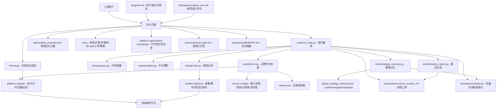
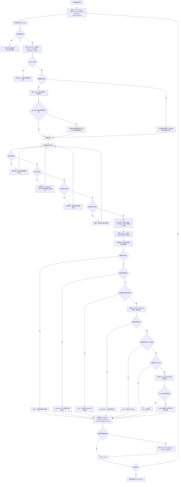

# 自定义硬件平台算子自动优化迭代框架开发指南

## 目标与边界

本文档描述如何为一个自定义硬件平台建设“算子自动优化迭代框架”。该框架的目标不是简单运行 benchmark，而是让优化代理能够按证据闭环持续完成以下工作：

- 理解算子正确性规格、输入形态、性能目标和平台约束。
- 在统一工具链下编译、运行、计时、校验和 profiling。
- 基于宏观性能与微观 profiling 证据提出单一优化假设。
- 对每轮实验保留完整可复现工件。
- 将成功、失败和拒绝策略写入记忆，避免重复消耗迭代轮次。
- 在优化方案设计阶段过滤低理论收益、 benchmark-shape 过拟合、历史相邻失败方向和只优化次要指标的方案。

本文档刻意使用通用硬件术语。具体平台可以是任意加速器、AI 处理器、DSP、SIMT/SIMD 设备、矩阵引擎设备或其他异构计算平台。平台适配时应把厂商专有概念映射成本文档定义的通用指标和抽象接口。

## 总体目录结构

推荐目录结构如下：

```text
project/
├── program.md
├── kernels/
├── kernels_optimized/
├── kernel.py
├── kernel_configs/
├── references/
├── platforms/
├── profilers/
├── tools/
├── docs/
├── knowledge/<platform_name>/OPTIMIZATION.md
├── memory/
└── workspace/
```

各目录职责：

- `kernels/`：只读基线算子实现。任何优化都不得直接修改这里的文件。
- `kernels_optimized/`：保存已验证的优化版本，用于恢复和交付。
- `kernel.py`：当前活动实验文件。每轮优化只修改该文件及其必要的同目录源码依赖。
- `kernel_configs/`：定义算子输入形态、数据类型、容差、参考函数、计算量和访存量。
- `references/`：平台无关的正确性规格或参考实现。
- `platforms/`：目标硬件平台执行适配层。
- `profilers/`：目标硬件 profiling 适配层。
- `tools/`：prepare、bench、profile、run_loop、strategy_memory、iteration_report 等通用工具。
- `docs/`：平台架构、存储、计算、同步、stall、实验工件和策略记忆说明。
- `knowledge/<platform_name>/OPTIMIZATION.md`：平台优化知识库，记录可复用模式和反模式。
- `memory/`：单算子多轮实验记忆。
- `workspace/`：运行态产物、结果表、预检报告、运行环境、全局记忆和每轮实验工件。

## 功能框架图

下面的功能框架图展示各模块之间的依赖关系。阅读时可以按三层理解：

- 上层是用户与优化代理入口，负责读取协议、提出方案、执行迭代。
- 中层是通用工具链，负责预检、benchmark、profiling、策略记忆和工件管理。
- 下层是平台适配、算子规格和知识库，负责把自定义硬件能力映射到通用优化流程。



### 模块关系说明

| 模块 | 输入 | 输出 | 主要责任 |
|---|---|---|---|
| `program.md` | 框架规则、项目约束 | 代理执行协议 | 定义优化代理必须遵守的流程、禁区和记录要求 |
| `kernel.py` | 当前实验代码、平台接口 | 可执行算子 | 承载每轮优化改动 |
| `kernel_configs/` | 算子规格 | 输入、容差、计算量、访存量 | 定义 benchmark 和 correctness 的统一问题空间 |
| `references/` | 平台无关参考实现 | 期望输出 | 提供正确性基准 |
| `platforms/` | 设备运行时、编译器、计时接口 | 统一执行能力 | 把真实硬件接入 bench 与 run loop |
| `profilers/` | 原始 profiler 报告 | 规范化指标 | 把厂商计数器转成通用瓶颈信号 |
| `tools/bench.py` | kernel、config、reference、platform | benchmark JSON | 判断正确性、宏观性能和 roofline 位置 |
| `tools/profile.py` | kernel、profiler backend | profile 报告和摘要 | 判断微观瓶颈和热点来源 |
| `tools/run_loop.py` | hypothesis、platform、kernel | run/iter 工件 | 编排一轮实验并生成可复现记录 |
| `strategy_memory` | proposal tags、实验结果 | preferred/blocked 约束 | 避免重复失败邻域，保留可复用成功策略 |
| `memory/` 与 `workspace/MEMORY.md` | 实验结果和人工结论 | 历史上下文 | 支撑下一轮方案设计和路线更新 |

### 数据流说明

1. 人类用户给出目标，优化代理读取 `program.md`、运行环境、历史记忆和平台知识。
2. 代理从 `kernel.py`、`kernel_configs/` 和 `references/` 建立当前算子上下文。
3. `tools/bench.py` 通过 `platforms/` 运行算子，生成 correctness 与宏观性能证据。
4. `tools/profile.py` 通过 `profilers/` 采集微观证据，并将原始平台指标规范化。
5. 代理用证据填充 `optimization_proposal.md`，通过影响门、泛化门、历史邻域门和优先级门。
6. 只有通过门禁的单一方案才进入代码修改。
7. run loop 将 benchmark、profile、proposal、summary、strategy outcome 写入 `workspace/runs/` 和 `workspace/results.tsv`。
8. 成功和失败都会更新 `memory/`、`workspace/MEMORY.md` 与 `strategy_memory`，成为下一轮约束。

## 核心组件

### 1. 平台执行适配层

位置：`platforms/<platform_name>/adapter.py`

作用：屏蔽不同硬件运行时、编译器、设备管理接口和计时接口差异，向框架提供统一能力。

必须实现：

- `validate_environment()`：检查运行时、驱动、编译器、设备可见性、权限、必要环境变量和版本兼容性。
- `detect_device()`：返回设备规格，例如设备名、设备 ID、显存/片上内存容量、峰值计算吞吐、峰值内存带宽、缓存或片上存储容量、其他硬件元数据。
- `default_device()`：返回输入生成器使用的设备标识。
- `synchronize()`：等待目标设备上所有待测工作完成。
- `reset_peak_memory_stats()` 与 `get_peak_memory_mb()`：提供峰值内存统计，若平台不支持，应明确返回不可用状态而不是伪造数据。
- `benchmark(fn, warmup, rep)`：提供稳定计时路径，包括 warmup、重复运行、同步、异常处理和中位数或稳健统计。
- `profiler_backend_name()`：声明对应 profiling 后端。
- 可选：编译、加载、缓存、清理、设备亲和性设置、频率/功耗模式固定等辅助能力。

注意点：

- 计时必须测量目标算子实际执行路径，不能把异步提交时间当作 kernel 时间。
- 设备峰值参数必须来自平台规格或官方工具，不得凭经验估计后写死。
- 预检失败时应给出可执行的修复信息。
- mock 平台只能用于流程演练，不能作为性能证据。

### 2. Profiling 适配层

位置：`profilers/<backend>.py`

作用：收集厂商 profiler 或运行时计数器报告，并转换成框架统一的指标 schema。

必须实现：

- `collect(kernel_file, output_dir)`：运行 profiler，生成原始报告。
- `analyze(report_path)`：解析原始报告，输出通用指标和结论。

建议输出的通用指标：

- `profile_compute_util`：计算单元利用率或计算吞吐占峰值比例。
- `profile_memory_util`：外部内存或主存带宽利用率。
- `profile_onchip_memory_util`：片上存储、scratchpad、共享缓存或等价结构压力。
- `profile_l1_hit_rate` / `profile_l2_hit_rate`：若平台有多级缓存，输出命中率；若没有，使用平台等价层级。
- `profile_occupancy`：执行资源驻留率、活跃线程组/向量组/任务组比例或等价并发度。
- `profile_register_pressure`：寄存器、向量寄存器、通用临时存储或等价资源压力。
- `profile_spill_pressure`：寄存器溢出、临时内存访问或等价现象。
- `profile_top_stall`：主 stall 原因，使用规范化名称。
- `profile_instruction_mix`：主要指令类别占比。
- `profile_vectorization_efficiency`：向量化或矩阵化利用效率。
- `profile_coalescing_efficiency`：访存合并、事务效率或等价指标。
- `profile_sync_overhead`：同步、等待、栅栏、队列依赖或等价开销。
- `profile_line_attribution`：可选但强烈建议，能把关键计数器归因到源码行、IR 行或机器指令。

注意点：

- 原始厂商计数器名可以保存到 `profile_details.txt`，但优化方案里应优先使用规范化指标。
- 如果只看到 aggregate metric，不应直接制定局部优化；高风险指标必须尽量做 source/IR/instruction attribution。
- profiling 工具失败、权限不足、报告缺失不能被当成性能结论。
- 每个指标必须有明确单位、采集范围和是否可跨版本比较的说明。

### 3. Benchmark 与正确性框架

位置：`tools/bench.py`、`kernel_configs/`、`references/`

作用：提供可重复的正确性和性能测量。

必须能力：

- 加载当前 `kernel.py`。
- 根据 `KERNEL_TYPE` 找到配置。
- 生成输入并运行参考实现。
- 执行 correctness，包括 smoke、形状覆盖、数值稳定性、确定性和边界输入。
- 输出结构化 JSON，包括 latency、throughput、bandwidth、peak memory、roofline 分类、错误信息。
- 计算通用 roofline 指标：计算吞吐、内存带宽、计算占峰值、带宽占峰值、算术强度、瓶颈分类。

配置文件应包含：

- benchmark sizes：小、中、大、边界等代表形状。
- dtypes：支持的数据类型。
- tolerances：按 dtype 定义误差阈值。
- input_generator：平台无关输入生成函数。
- reference_fn：正确性参考。
- flops_fn：计算量估算。
- bytes_fn：访存量估算。
- numerical_stability_cases：可选，定义特殊数值输入。
- edge_cases：可选，定义边界形态。

注意点：

- benchmark shape 用于评测，不等于可优化的不变量。
- 若实际使用中某个维度可变，不允许围绕该维度做编译期特化或 benchmark-only dispatch。
- reference 实现只能用于正确性和性能对比，不能作为优化实现替代。
- quick benchmark 只能用于筛选，最终保留必须经过完整验证。

### 4. 运行循环与工件管理

位置：`tools/run_loop.py`、`tools/iteration_report.py`、`workspace/runs/`

作用：驱动单轮或多轮实验，并保证每轮都有可复现工件。

每个 run 应生成：

- `run_manifest.json`：运行配置、平台、算子、迭代列表、最佳迭代。
- `preflight_check.json` / `preflight_check.md`：环境预检。
- `final_summary.md`：本 run 总结。

每个 iteration 应生成：

- `kernel.snapshot.py`：实验前或实验后快照，按框架定义固定。
- `benchmark_result.json`
- `benchmark.stdout.txt`
- `benchmark.stderr.txt`
- `profile_report.txt` 或厂商原始报告路径
- `profile_summary.txt`
- `profile_details.txt`
- `profile.stdout.txt`
- `profile.stderr.txt`
- `optimization_proposal.md`
- `iteration_summary.md`

注意点：

- 所有命令、输出、错误和版本信息都必须落盘。
- 不完整 profiling 不能作为保留实验的主要证据。
- 结果表和 markdown 总结都应引用工件路径，便于之后复查。
- run loop 不应把 mock 或 placeholder 的性能数据写成真实优化结论。

### 5. 策略记忆系统

位置：`tools/strategy_memory.py`、`workspace/strategy_memory/global_strategy_memory.json`、`docs/strategy_memory.md`

作用：记录跨轮次、跨算子的策略结果，避免重复尝试已失败方向。

状态分类：

- `positive`：通过正确性，性能超过保留阈值，且 profiling 证据完整。
- `negative`：正确但性能持平或更差。
- `rejected`：正确性失败、编译失败、profiling 缺失、违反规则或证据不完整。

每条记录应包含：

- `strategy_tags`
- `strategy_fingerprint`
- 适用平台和算子类型。
- 实验 ID、父实验 ID、run/iter 目录。
- macro 指标和 profile 摘要。
- outcome 与 reason。
- 是否属于相邻策略、是否有新证据推翻旧结论。

注意点：

- 不要只做精确 fingerprint 匹配。一个失败策略会阻断邻近策略，除非 profiling 证明瓶颈已移动。
- 邻近策略包括同一热点循环的不同 unroll、同一布局族的不同 pitch、同一 tile sweep、同一资源 hint、同一边界特化、同一低覆盖路径变体。
- 重新尝试邻近失败方向时，proposal 必须写明旧失败记录、新证据和理论收益上限。

## 必需文档清单

### `program.md`

作用：代理执行协议。

应包含：

- 仓库目录约束。
- 基线文件只读规则。
- 活动 kernel 文件规范。
- 运行环境准备流程。
- benchmark、profile、proposal、modify、decide、record 的循环规则。
- keep/revert 阈值。
- 禁止替换为库实现的规则。
- 影响门、泛化门、历史邻域门、优先级门。
- 工件要求和结果记录要求。

注意点：

- 应保持平台通用，不写入具体算子属性或厂商硬件细节。
- 不应出现“某个算子的特殊 mask、特殊维度、特殊布局”等强绑定描述。
- 可以描述“运行时可变维度不得 benchmark 特化”，但不要写成某个具体维度。
- 所有命令示例应使用项目实际 wrapper，不鼓励绕过框架直接测量。

### `workspace/MEMORY.md`

作用：全局优化摘要。

应包含：

- 每个 run 或重要阶段的简短结论。
- 当前最佳性能和主要瓶颈。
- 可迁移的成功经验。
- 可迁移的失败经验。
- 下一步方向。

注意点：

- 保持短而可读，不替代 per-kernel 详细日志。
- 记录结论时必须包含证据来源。
- 避免写入未验证猜测。

### `memory/<kernel_type>.md`

作用：单算子详细实验史。

应包含：

- 每轮实验的 hypothesis。
- macro benchmark 指标。
- micro profile 指标。
- 改动摘要。
- correctness 与性能结果。
- kept / reverted / rejected 决策。
- 失败原因和后续禁区。
- 新增路线结论。

注意点：

- 反模式要写清楚“为什么失败”，而不是只写“变慢”。
- 如果是相邻失败族，应明确阻断哪些后续方向。
- 对结构性瓶颈要明确下一步应改变设计边界，而不是继续局部微调。

### `workspace/results.tsv`

作用：机器可读实验索引。

建议字段：

```text
experiment_id
hypothesis
correctness
time_ms
throughput
peak_memory_mb
kept
achieved_compute
achieved_bandwidth
peak_compute
peak_bandwidth
bottleneck
git_sha
parent_experiment_id
profile_top_stall
profile_occupancy
profile_l1_hit_rate
profile_l2_hit_rate
strategy_tags
strategy_fingerprint
strategy_outcome
strategy_reason
run_dir
iter_dir
profile_report
```

注意点：

- 字段应长期稳定。
- 单位必须固定。
- 缺失指标使用空值，不要填虚假数字。

### `workspace/optimization_proposal.template.md`

作用：每轮优化方案模板。

应包含：

- Backend / Platform。
- Primary references。
- Evidence：benchmark 与 profile 证据。
- Impact gate：动态覆盖率、理论最大收益、keep threshold 对比。
- Generality gate：是否依赖 benchmark-only 常量，是否适配运行时可变输入。
- Strategy constraints from memory：blocked / preferred / adjacent negatives。
- Strategy tags。
- This iteration：单一改动、预期改善指标、风险和验证方法。

注意点：

- proposal 必须在改代码前完成。
- 不能只写“可能更快”，必须有理论收益估计。
- 如果是可行性探针，应明确它服务于哪个更大的结构性方向。

### `knowledge/<platform_name>/OPTIMIZATION.md`

作用：平台级优化知识库。

应包含：

- 平台架构摘要。
- 通用优化模式。
- 成功案例。
- 失败案例。
- 指标解释索引。
- 不同瓶颈类型对应策略。
- 不同算子类型的优先检查项。

注意点：

- 只记录经过实验或官方文档支撑的内容。
- 反模式和禁区要可 grep。
- 使用通用标签，例如 `[memory-access]`、`[vectorization]`、`[onchip-memory]`、`[compute-pipeline]`、`[occupancy]`、`[synchronization]`、`[dataflow]`。

### `docs/arch_notes.md`

应包含：

- 执行模型：线程、向量 lane、subgroup、workgroup、tile 或平台等价概念。
- 计算单元层级和调度模型。
- 矩阵/向量/标量计算单元能力。
- 数据类型支持和吞吐比例。
- 寄存器或临时存储限制。
- 片上存储、缓存、跨层级带宽和延迟。
- occupancy/residency 约束。
- 编译器和运行时关键限制。

注意点：

- 明确哪些是官方规格，哪些是经验结论。
- 所有峰值指标注明单位和数据类型。

### `docs/memory_optimization.md`

应包含：

- 主存访问合并规则。
- 对齐要求。
- 向量化 load/store 推荐宽度。
- 缓存/片上存储层级。
- scratchpad 或共享片上存储使用方法。
- 数据预取、异步搬运或流水化能力。
- 常见低效访存模式与 profiler 识别方法。

### `docs/compute_optimization.md`

应包含：

- 标量、向量、矩阵单元使用规则。
- 指令吞吐、延迟和典型瓶颈。
- 数据类型选择。
- reduction、scan、broadcast、transpose 等常见模式。
- 如何判断算子是否适合矩阵化或向量化。
- 何时比较标量/向量路径与矩阵路径，而不是默认使用矩阵单元。

### `docs/stall_reasons.md`

应包含：

- profiler stall 名称到通用含义的映射。
- 每类 stall 的典型原因。
- 对应优化策略。
- 误判风险，例如 aggregate stall 高但只集中在低覆盖源码行。

### `docs/experiment_artifacts.md`

应包含：

- run/iteration 目录结构。
- 每个文件的生成者、内容、用途。
- 如何复现实验。
- 如何比较 before/after。
- 如何归档大型 profiler 报告。

### `docs/strategy_memory.md`

应包含：

- strategy tag 规范。
- fingerprint 规则。
- positive/negative/rejected 定义。
- negative-neighborhood rule。
- impact gate。
- generality gate。
- source/IR/instruction attribution 要求。

## 硬件相关参考文档

为适配真实平台，至少需要以下资料。若厂商文档缺失，必须通过 microbenchmark 或 profiler 实验补足，并标注为经验结论。

- 架构白皮书或编程模型文档。
- 设备规格表：峰值计算吞吐、峰值内存带宽、片上存储容量、缓存层级、频率范围。
- ISA、IR 或 kernel 编程指南。
- 编译器选项与优化指南。
- 运行时 API 文档：设备管理、内存管理、同步、事件、计时、错误码。
- Profiler 用户指南：计数器含义、采样限制、source attribution 方法、报告导出方式。
- 数值类型与数学函数说明：精度、舍入、特殊值、低精度行为。
- 内存一致性与同步语义。
- 已知限制和性能陷阱。

## 功能流程图

下面的流程图描述一次完整优化迭代中的步骤关系、分支节点和判定规则。实现 `tools/run_loop.py` 时可以把它作为状态机参考。



### 流程判定表

| 分支节点 | 通过条件 | 不通过处理 |
|---|---|---|
| 环境预检 | 设备、运行时、编译器、profiler、权限和推荐命令可用 | 修复平台适配或环境，不进入性能实验 |
| baseline 正确性 | 当前活动 kernel 与 reference 在基础和边界输入上匹配 | 停止优化，先修复 baseline、config 或 reference |
| aggregate 归因 | 指标能直接定位到高覆盖源码、IR 或机器指令 | 若无法归因，只能做宏观结构判断，不做局部微调 |
| 影响门 | 理论最大收益高于阈值，且触达主动态路径 | 拒绝或暂缓，避免消耗迭代轮次 |
| 泛化门 | 不依赖真实运行中可变的 benchmark 常量 | 拒绝 benchmark-shape 过拟合方案 |
| 历史邻域门 | 不重复相邻失败，或有新证据证明旧结论失效 | 拒绝相邻微变体 |
| 优先级门 | 在候选中具备最高收益/风险比 | 暂缓低优先级方案 |
| 快速正确性 | 基础输入和数值稳定性无明显错误 | reject/revert 并记录触发输入 |
| 快速性能 | 提升明显超过测量噪声 | 否则 revert 或记为低收益 negative |
| 完整 benchmark | 多形态 correctness 通过，主指标超过 keep 阈值 | correctness 失败则 reject，性能不足则 negative |
| after profile | 目标瓶颈指标改善且不引入新主瓶颈 | 若假设不成立，按风险选择 revert 或暂缓 |
| 路线更新 | 新证据推翻原优化方向或新增明确禁区 | 更新 memory、knowledge 和 anti-pattern |

### 判定规则细化

- 环境失败不是性能失败。平台 adapter 或 profiler 未实现时，只能记录工程阻塞，不能写成优化结论。
- 正确性失败优先级高于性能。任何速度提升只要伴随错误输出，都不应进入 keep。
- quick benchmark 只做筛选。保留优化必须经过完整 benchmark；对高风险结构性改动还需要 after profile。
- 指标改善不等于端到端收益。若目标计数器改善但 latency 不改善，不应 keep。
- after profile 不是每轮都必须，但当方案声称解决某个微观瓶颈时必须执行。
- 若某轮发现主瓶颈归因与原路线不同，必须更新路线文档和拒绝项，避免后续继续沿错误方向微调。

## 优化迭代流程

推荐每轮流程如下：

1. `prepare`：环境预检，确认平台、设备、编译器、profiler、运行时都可用。
2. `baseline bench`：运行完整 benchmark，获取正确性、latency、throughput、bandwidth、roofline 分类。
3. `profile`：采集微观指标，确认主瓶颈。
4. `source attribution`：当 aggregate metric 指向局部问题时，进一步定位到源码、IR 或指令。
5. `proposal`：写单一优化假设，完成 impact/general/history/priority gate。
6. `modify`：只做 proposal 中的一项改动。
7. `quick verify`：快速正确性和性能筛选。
8. `full verify`：完整正确性、完整 benchmark、必要 profiling。
9. `decide`：根据阈值 keep/revert/reject。
10. `record`：写 results、iteration summary、per-kernel memory、global memory、platform knowledge。
11. `route update`：如果 profiling 证据推翻原路线，更新后续计划和拒绝项。

## Keep / Revert / Reject 规则

- 正确性失败：立即 reject 或 revert。
- 编译失败：reject，记录错误，不计为性能证据。
- profiling 缺失：不能 keep，除非本轮明确只是非性能预检。
- 性能提升低于阈值：默认 revert，记录为 negative。
- 性能提升超过阈值但只影响 benchmark 特定形态：reject 或 defer，除非该形态是 API/生产不变量。
- aggregate 指标改善但 full benchmark 无改善：不 keep。
- quick benchmark 有小幅提升但低于噪声阈值：不 keep。
- 结构性方向的最小可行性探针可以允许性能不佳，但必须明确其目的是验证编译、正确性或 IR/机器指令形态，不能当作优化成功。

建议阈值：

- full benchmark keep threshold：至少 `>1%`，具体按平台噪声调整。
- quick benchmark 进入 full 验证 threshold：应明显高于噪声，通常需要 `>1-2%`。
- 多 shape 算子：不能只看主 shape，至少不能显著恶化重要生产形态。

## 优化方案设计规则

### 影响门

每个方案必须回答：

- 触达了多少动态工作量？
- 如果触达部分完全免费，端到端最大收益是多少？
- 这个收益是否高于 keep threshold 和测量噪声？
- 是否攻击主瓶颈，还是只优化次要指标？

拒绝以下方案：

- 只覆盖尾块、边界、少数特殊输入。
- 理论最大收益低于阈值。
- 只减少指令数但热点覆盖很小。
- 主瓶颈是计算却只调内存布局，或主瓶颈是内存却只调算术微指令。

### 泛化门

每个方案必须回答：

- 是否依赖 benchmark 固定大小？
- 是否依赖真实使用中会变化的维度、batch、网格、tile 数或输入分布？
- 专门化依据是否属于 API、算子语义、数据布局契约、硬件架构或生产不变量？
- 是否可以用运行时 tile-state 检查替代编译期特化？

拒绝以下方案：

- 对运行时可变维度做编译期特化。
- 为 benchmark shape 添加专用 dispatch。
- 删除真实输入可能需要的检查。
- 用评测集特征替代算子契约。

### 历史邻域门

每个方案必须检查：

- `memory/<kernel_type>.md`
- `workspace/MEMORY.md`
- `workspace/results.tsv`
- `workspace/strategy_memory/global_strategy_memory.json`
- `knowledge/<platform_name>/OPTIMIZATION.md`

如果相邻策略失败，必须有新证据说明：

- 瓶颈已经移动。
- 旧失败原因已被当前改动消除。
- 新方案理论收益明显高于阈值。

否则跳过。

### 证据优先级门

候选方案排序应基于：

- 主瓶颈相关性。
- 动态覆盖率。
- 理论收益上限。
- 实现风险。
- 正确性风险。
- 是否会降低并发度或增加关键资源压力。
- 是否需要平台专有低级实现。
- 历史相邻策略结果。

早期轮次只做高覆盖结构性方案；低覆盖清理和微调应后置。

### 指标归因门

当某个 aggregate 指标异常时，不应直接做泛化调参。必须尽量确认：

- 指标来自哪些源码行、IR 操作或机器指令。
- 这些行是否处在高动态覆盖路径。
- 改动是否直接修改这些行或其数据流。
- 指标降低是否会转化为端到端性能，而不是只改善次要计数器。

如果 attribution 显示热点不在计划修改的代码区域，应拒绝该方案。

## 常见角色分工

- 平台工程师：实现 adapter、profiler、编译加载、设备规格、平台文档。
- 算子工程师：实现 kernel、reference、config、正确性案例。
- 优化代理：执行 program.md 流程，提出 proposal，修改 kernel，运行验证，记录记忆。
- 评审者：检查是否违反泛化门、影响门、历史邻域门和 artifact 完整性。

## 最小可用版本验收标准

一个自定义平台适配达到可用状态，至少应满足：

- `tools/prepare.py` 能输出真实预检结果。
- `tools/bench.py` 能在真实设备上运行当前 `kernel.py`，输出完整 JSON。
- `tools/profile.py` 能生成真实 profiler 报告和规范化摘要。
- `tools/run_loop.py` 能生成 run/iter 工件并更新结果表。
- `workspace/optimization_proposal.template.md` 包含 impact、generality、history、priority 相关字段。
- `workspace/strategy_memory/global_strategy_memory.json` 能记录 positive/negative/rejected。
- `knowledge/<platform_name>/OPTIMIZATION.md` 至少包含平台峰值、执行模型、存储层级、常见瓶颈和初始策略。
- 至少一个示例算子能完成 baseline、一次失败实验、一次成功或有效 negative 实验的完整闭环。

## 开发注意事项

- 框架首先追求证据质量和可复现性，其次才是自动化轮次数。
- 所有平台专有概念都应映射到通用 schema，避免把厂商计数器名散落到 proposal 和 memory。
- 不要把 benchmark 配置误认为真实生产不变量。
- 不要因为某个指标很大就直接优化它，先确认 source/IR/instruction 归因和端到端收益空间。
- 不要连续多轮尝试同一失败邻域的微小变体。
- 不要用库实现替代自定义 kernel。
- 不要在环境未准备好或 profiler 不可用时继续做性能结论。
- 每轮实验的价值不仅是保留代码，也包括把失败原因变成后续可执行的约束。
